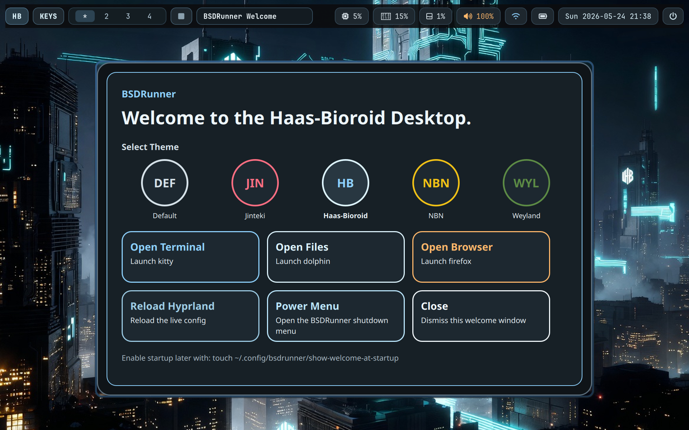
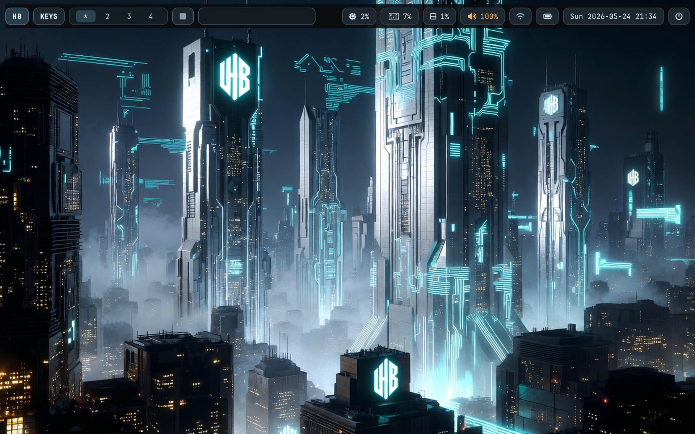

# BSDRunner

Hyprland config for FreeBSD 15. Primarly designed for my IBM ThinkPad X1 Gen 9
but maybe it will work for you, too.

## Screenshots

### Welcome Screen



### Sample Desktop



# Netrunner
The themes are based on the four corporations from the card game Android: Netrunner.
Note that while based on that game, the artwork here is all AI generated.

# Overview
This repo is intentionally small:

- a modular Hyprland config with a thin top-level loader
- Waybar in the default startup path
- `swww` in the themed startup path
- no lockscreen, notification daemon, or idle daemon by default
- no generated monitor config
- a neutral base with optional corp theme layers

The goal is a nice, bootable base session for Hyprland `0.54.x` on FreeBSD.

## Files

- `dotfiles/.config/hypr/hyprland.conf`
- `dotfiles/.config/hypr/conf/`
- `dotfiles/.config/kitty/kitty.conf`
- `dotfiles/.config/quickshell/`
- `dotfiles/.config/waybar/`
- `dotfiles/.config/bsdrunner/themes/`
- `dotfiles/.config/bsdrunner/pf/`
- `system/etc/pf.conf`
- `scripts/install-dotfiles.sh`
- `docs/freebsd-setup.md`
- `docs/freebsd-dev-lab.md`
- `docs/themes.md`
- `docs/software-center.md`
- `docs/pf.md`
- `docs/dns.md`

## Quick Start

```sh
./scripts/install-dotfiles.sh
```

Install and apply a corp theme:

```sh
./scripts/install-dotfiles.sh --theme jinteki
```

Implemented corp themes:

- `jinteki`
- `haas-bioroid`
- `nbn`
- `weyland`

Each implemented corp theme currently ships:

- a Kitty theme fragment
- a Rofi theme
- a generated Firefox profile theme
- Waybar styling
- bundled wallpapers for `swww`
- a Kitty watermark asset

Wallpaper selection is automatic during install. Themes that ship multiple wallpapers rotate them by workspace number through the `swww` helper.

Return to the neutral baseline:

```sh
./scripts/install-dotfiles.sh --theme default
```

## Default Binds

- `Super+Q`: open `kitty`
- `Super+C`: close focused window
- `Super+E`: open `dolphin`
- `Super+D`: open `rofi -show drun`
- `Super+F`: open `firefox`
- `Super+V`: toggle floating
- `Super+W`: open the optional welcome window
- `Super+X`: exit Hyprland

## Validated Apps

The following have been tested in the current FreeBSD/Hyprland bring-up:

- terminal: `kitty`
- browser: `firefox`
- launcher: `rofi`
- file manager: `dolphin`

Possible lighter Qt alternative:

- `pcmanfm-qt`

## Theme Switching

BSDRunner currently supports two in-session theme switching paths:

- the optional welcome window on `Super+W`
- the Waybar theme button on the left side of the bar

Both paths call the same theme apply script and update:

- Kitty config for new windows
- Rofi theme
- Firefox profile chrome/content CSS
- Waybar config and style
- wallpaper selection and `swww` rotation
- Hyprland border colors

Waybar also includes a few lightweight control-surface actions:

- theme switcher
- apps launcher
- power menu

Existing Kitty windows will not fully restyle in place. Open a fresh Kitty window after switching themes. Firefox reads profile chrome CSS on startup, so restart Firefox after switching BSDRunner themes.

## Firewall

BSDRunner includes a desktop-focused PF baseline and a first-pass Quickshell firewall control surface.

Launch the graphical firewall after installing the dotfiles:

```sh
sh ~/.config/bsdrunner/scripts/bsdrunner-pf.sh
```

The GUI manages a BSDRunner desktop profile, not arbitrary PF syntax. See `docs/pf.md` for the baseline, validation commands, smoke tests, and rollback path.

## DNS Cache

BSDRunner includes a first-pass Quickshell control surface for FreeBSD's base `local_unbound` service.

Launch it after installing the dotfiles:

```sh
sh ~/.config/bsdrunner/scripts/bsdrunner-dns.sh
```

The GUI starts in read-only status mode until you choose an action. See `docs/dns.md` for backend commands and manual acceptance checks.

## ZFS

BSDRunner includes a laptop-focused ZFS snapshot surface for pool health, datasets, and basic snapshot actions.

```sh
sh ~/.config/bsdrunner/scripts/bsdrunner-zfs.sh
```

See `docs/zfs.md` for the backend commands and scope.

## Scope

This starter is targeted at:

- FreeBSD 15
- Hyprland `0.54.x`
- ThinkPad X1 Gen 9

The current repo already includes a working Waybar autostart and `swww` wallpaper path. The next risky layers are things like lockscreen, idle, extra desktop daemons, or deeper Qt/KDE theming.

## Animated Wallpaper

For the curious, Haas-Bioroid also supports an animated wallpaper setup with a per-workspace play/pause toggle on the bar:


# Creator
Daniel J. Berger

# License
MIT
